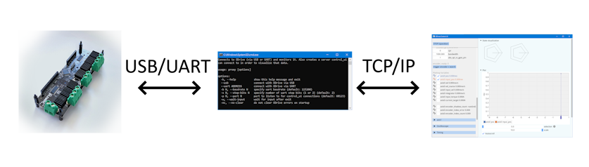

# Overview
This repository contains some tools and a library that are helpful when using ODrive:
 - control_ui: Connects to proxy application and visualizes ODrive data over time. It also controls the ODrive and helps with tuning all kinds of parameters.
 - proxy: Helper application that directly connects to ODrive (via USB or UART) and publishes that data via TCP/IP to control_ui.
 - It also contains a helper library that helps with the custom protocol that ODrive uses.

 Everything here is in C++ and should compile on Windows and Linux (tested on Ubuntu and WSL).

Here is a diagram that shows the connection:
 

## Control UI
This is a native application that visualizes ODrive data
 - Polls any data and displays it in a graphical user interface
 - Plotting over long time periods
 - Sets any ODrive values via UI
 - Displays oscilloscope data (When using custom firmware)
 - Indirect communication with ODrive. The proxy application polls the ODrive data and this one connects via TCP and visualizes it. This way no direct USB/UART connection between ODrive and Control UI is required.
 - It is easily extended to plot other values retrieved by the proxy application. Or computed ones. This is useful when you have other sensors or want to debug control algorithms.
 - Plots are quite scalable: This [repo](https://github.com/helmutbuhler/milana_robot) shows how to extend this application to monitor about 300 variables and it's still very fast and the UI is not overwhelming,
 - Easy to add graphical visualizations of the joint states or video streams and keep it all synchronized.
 - Also should work with ODrive S1 and Pro, but I havn't tried it yet.
 - No JS;)

## Proxy
This is a helper application that directly connects to the ODrive (with the helper library) and basically polls all kinds of values with a frequency of 100Hz. It also opens a server from which it can receive commands.
This is useful for example when you have a robot with a small single-board computer that is connected to the ODrive(s). In that scenario you can start the proxy on the robot and start the Control UI on your PC and connect it.

Right now the proxy works with either the official ODrive firmware 0.5.6 or with the unofficial version [here](https://github.com/helmutbuhler/odrive_milana). But if you want to use another version or build your own, it should be easy to adapt the code.

## C++ Library to communicate with ODrive via USB/UART
A small library that handles USB/UART communications with an ODrive motor controller.
 - Can read and write any values
 - Can call any function
 - Works with any firmware because it automatically downloads the json interface

Here is a small usage example:

```
ODrive odrive;
odrive.connect_usb();

float bus_voltage = odrive.root("vbus_voltage").get2<float>(); // This gets the 'vbus_voltage' paramater from the ODrive and assigns it to bus_voltage
Endpoint& axis0 = odrive.root("axis0");  
float motor0_position;
axis0("controller")("input_pos").get(motor0_position); // This gets the 'input_pos' paramater of the first axis from the ODrive
axis0("controller")("input_pos").set(20.0f); // This sets the 'input_pos' paramater of the first axis
```
The original code is from: https://github.com/tokol0sh/Odrive_USB and was modified to also handle UART, be more reliable, handle function calls and be easier to use. The code is still a bit messy though.

It should work with all firmware versions >= 0.5.1 on ODrive 3. I haven't tested it on ODrive Pro/S1 but it should work there with minimal changes too. The library just consists of a bunch of .cpp and .h files located here: `common/odrive`.


## Build
### Windows
To build on Windows, you need VS2019 or up. Clone this repository and open `odrive_control_ui.sln`. It should build out of the box.

### Linux
To build on Linux, first we need some packages:
```
sudo apt install cmake libglfw3-dev libglm-dev libusb-1.0-0-dev libasound2-dev build-essential gnome-terminal
```

Next clone the repository, cd into it and do this:
```
mkdir build
cd build
cmake -DCMAKE_BUILD_TYPE=Release ..
make
```

Then you can start Control UI with:
```
./control_ui
```
